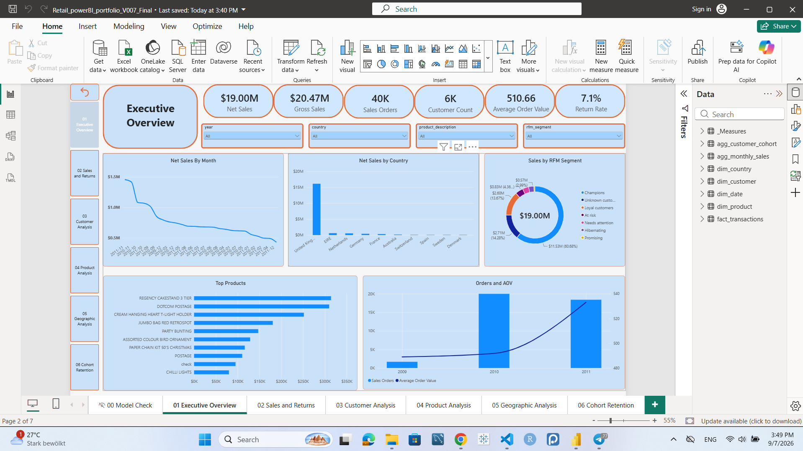
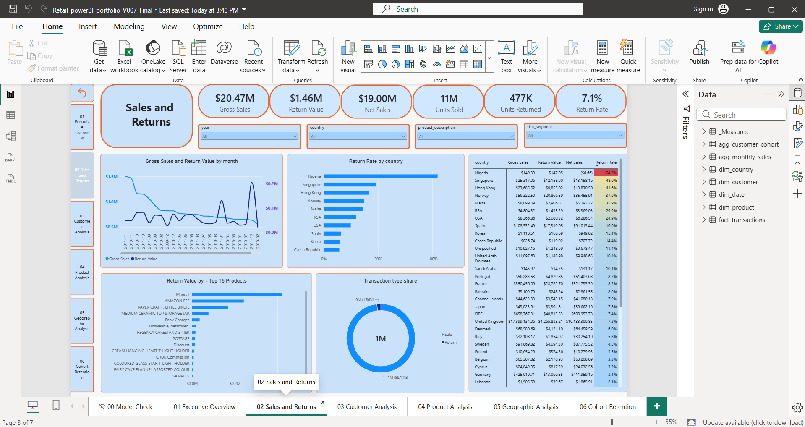
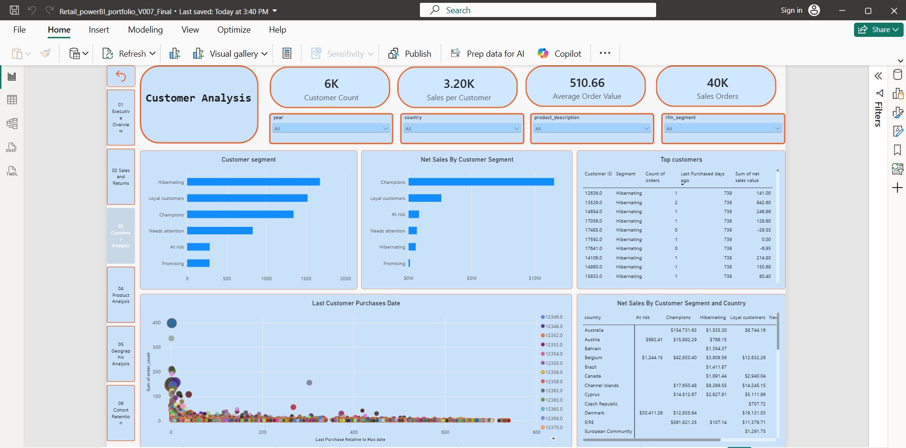
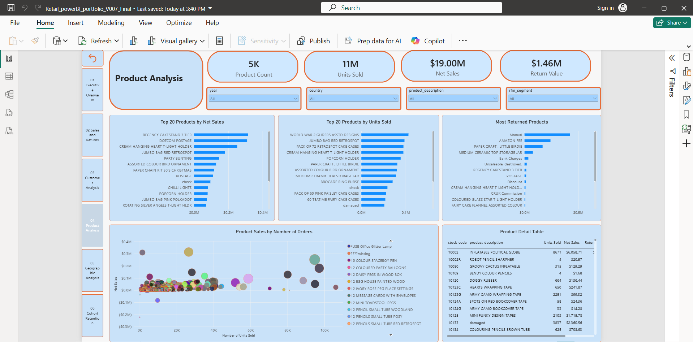
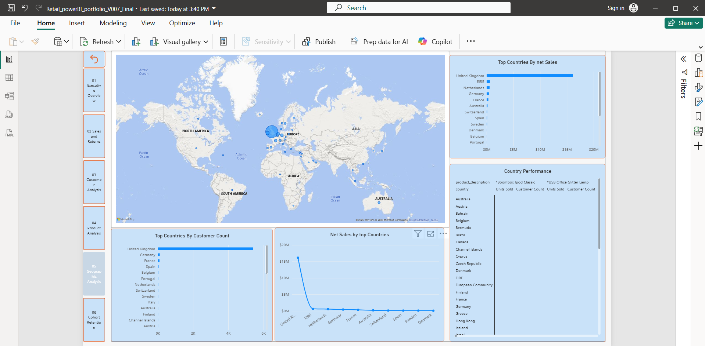
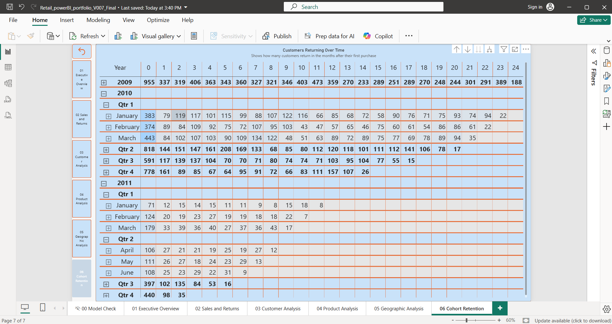

# Retail BI Analytics Portfolio Project

End-to-end retail analytics project built from the raw **Online Retail II** dataset using **Python, DuckDB SQL, Parquet, and Power BI**.

The project demonstrates a complete analytics workflow: raw data ingestion, cleaning, transformation, dimensional modelling, validation, customer analytics, and interactive business intelligence reporting.

## Project Overview

The objective of this project is to transform raw retail transaction data into a reproducible analytics pipeline and a business-facing Power BI solution.

The workflow covers:

- Python-based ingestion and data preparation;
- SQL transformations using DuckDB;
- data-quality validation and duplicate handling;
- sales and returns modelling;
- star-schema construction;
- customer RFM segmentation;
- cohort analysis;
- analytical Parquet exports;
- Power BI data modelling and DAX measures;
- interactive dashboards for sales, customers, products, geography, and retention.

## What This Project Demonstrates

- Reproducible ingestion of two raw Excel worksheets
- Source profiling and explicit data-quality decisions
- SQL-based cleaning and exact-duplicate handling
- Separation of sales, returns, and administrative adjustments
- Validated star schema for Power BI
- Customer RFM segmentation
- Customer cohort and retention analysis
- Compressed Parquet exports
- Relationship and dimension-key validation
- DAX-based business KPIs
- Interactive Power BI dashboard development
- End-to-end analytics workflow from raw data to business reporting

## Technology Stack

| Area | Technology |
|---|---|
| Data ingestion | Python |
| Data manipulation | Pandas |
| Analytical database | DuckDB |
| Transformation | SQL |
| Storage | Parquet |
| Data modelling | Star schema |
| Business intelligence | Power BI |
| Measures | DAX |
| Development | VS Code / Jupyter |
| Version control | Git / GitHub |

## Pipeline

```text
Raw Online Retail II workbook
             |
             v
Python ingestion and provenance fields
             |
             v
DuckDB raw + cleaned layers
             |
             v
Validated star schema
      |       |       |       |
    Date   Product  Customer Country
      \       |       |       /
          Fact Transactions
                 |
                 v
      ZSTD-compressed Parquet
                 |
                 v
        Power BI data model
                 |
                 v
       Interactive dashboards
```

## Data Model

The Power BI model follows a star-schema design centred on the transaction fact table.

Main analytical tables include:

- `fact_transactions`
- `dim_date`
- `dim_product`
- `dim_customer`
- `dim_country`
- `agg_monthly_sales`
- `agg_customer_cohort`

The model supports sales analysis, return analysis, customer segmentation, product performance, geographic analysis, and cohort behaviour.

## Power BI Dashboard

The final Power BI report contains six business-facing analytical pages.

### 1. Executive Overview

High-level view of retail performance including net sales, gross sales, order volume, customer count, average order value, return rate, monthly trends, geographic performance, customer segments, and leading products.



### 2. Sales & Returns

Analysis of gross sales, returns, net sales, units sold, units returned, return rates, transaction types, product returns, and country-level return behaviour.



### 3. Customer Analysis

Customer-level analysis using purchasing behaviour, sales value, recency, order frequency, and RFM segmentation to identify important customer groups.



### 4. Product Analysis

Product-level analysis designed to identify leading products, sales contribution, order activity, and differences in product performance.



### 5. Geographic Analysis

Country-level analysis of retail activity and performance across geographic markets.



### 6. Cohort Retention

Customer cohort analysis groups customers according to acquisition period and tracks how many remain active in subsequent periods.



## Key Business Metrics

The Power BI semantic model includes measures for metrics such as:

- Gross Sales
- Return Value
- Net Sales
- Sales Orders
- Average Order Value
- Customer Count
- Sales per Customer
- Units Sold
- Units Returned
- Return Rate
- Product Count
- Return Invoices
- Year-over-Year Sales Change

These measures respond dynamically to report filter context.

## Customer Analytics

Customer behaviour is analysed using **RFM-style segmentation**.

Customers are grouped according to characteristics such as:

- how recently they purchased;
- how frequently they ordered;
- how much value they generated.

The resulting segments include customer groups such as:

- Champions
- Loyal customers
- Promising
- Needs attention
- At risk
- Hibernating

The project also includes cohort analysis to examine customer activity after acquisition.

## Repository Structure

```text
retail-bi-project/
│
├── dashboards/
│   └── Retail_powerBI_portfolio_V007_Final.pbix
│
├── data/
│   ├── raw/
│   │   └── online_retail_2.xlsx
│   │
│   ├── clean/
│   │   └── online_retail_combined.csv
│   │
│   └── processed/
│       ├── fact_transactions.parquet
│       ├── dim_customer.parquet
│       ├── dim_product.parquet
│       ├── dim_country.parquet
│       ├── dim_date.parquet
│       ├── agg_monthly_sales.parquet
│       └── agg_customer_cohort.parquet
│
├── docs/
│   ├── DATA_DICTIONARY.md
│   ├── POWER_BI_HANDOFF.md
│   └── validation/
│
├── notebooks/
│   └── retail_bi_pipeline.ipynb
│
├── sql/
│   └── queries/
│       ├── 01_build_retail_model.sql
│       └── 02_portfolio_analysis_queries.sql
│
├── screenshots/
│   ├── 01_executive_overview.png
│   ├── 02_sales_returns.png
│   ├── 03_customer_analysis.png
│   ├── 04_product_analysis.png
│   ├── 05_geographic_analysis.png
│   └── 06_cohort_retention.png
│
├── .gitignore
├── requirements.txt
└── README.md
```

## Analytical Grain and KPI Policy

The project uses explicit rules to keep analytical metrics consistent.

- **Raw grain:** one row from one workbook worksheet.
- **Fact grain:** one deduplicated, commercially valid invoice-product line.
- **Sales:** normal invoices with positive quantity and price.
- **Returns:** `C` invoices with negative quantity and positive price.
- Administrative and stock adjustments remain auditable but do not enter commercial KPIs.
- Missing customer IDs use an explicit unknown member so total revenue can still reconcile.

## Data Quality and Validation

The pipeline includes validation steps covering:

- duplicate records;
- missing identifiers;
- transaction classification;
- dimension keys;
- fact-to-dimension relationships;
- Power BI export structure;
- sales and return definitions;
- unknown customer handling.

Validation outputs are stored under:

```text
docs/validation/
```

This makes the transformation from raw transactions to the Power BI model auditable.

## Reproducing the Project

The repository contains the data and code required to inspect and reproduce the workflow.

### 1. Clone the repository

```bash
git clone <repository-url>
cd retail-bi-project
```

### 2. Create a virtual environment

```bash
python -m venv .venv
```

Activate the environment and install the dependencies:

```bash
python -m pip install -r requirements.txt
```

### 3. Run the pipeline

Open:

```text
notebooks/retail_bi_pipeline.ipynb
```

in VS Code or Jupyter.

Select the project virtual-environment kernel and choose:

**Restart Kernel and Run All Cells**

The pipeline performs the ingestion, transformation, validation, and export steps required for the analytical model.

### 4. Inspect the generated analytical tables

Power BI-ready tables are available under:

```text
data/processed/
```

### 5. Open the Power BI report

The final report is located at:

```text
dashboards/Retail_powerBI_portfolio_V007_Final.pbix
```

The Power BI handoff documentation provides additional information about the model structure and relationships:

```text
docs/POWER_BI_HANDOFF.md
```

## Data Availability

The project uses the publicly available **Online Retail II** dataset.

For portfolio reproducibility, this repository includes the source workbook together with cleaned and processed analytical datasets. This allows the complete workflow to be inspected from the original source data through Python and SQL transformations to the final Power BI report.

The repository intentionally excludes temporary development databases and intermediate Power BI development versions.

## Project Highlights

This project demonstrates the ability to move beyond an isolated dashboard and build a complete analytics solution:

**Raw data → Data quality → Python → SQL → Dimensional model → Validation → DAX → Power BI → Business insights**

The repository therefore contains both the analytical engineering workflow and the final business-facing reporting layer.